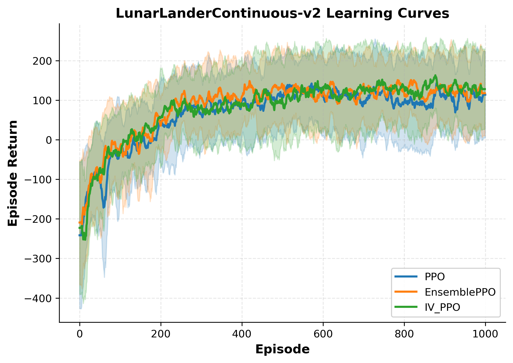
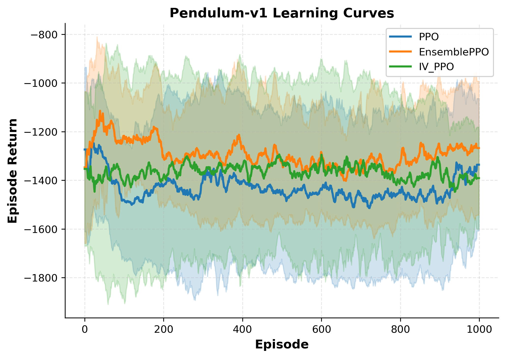
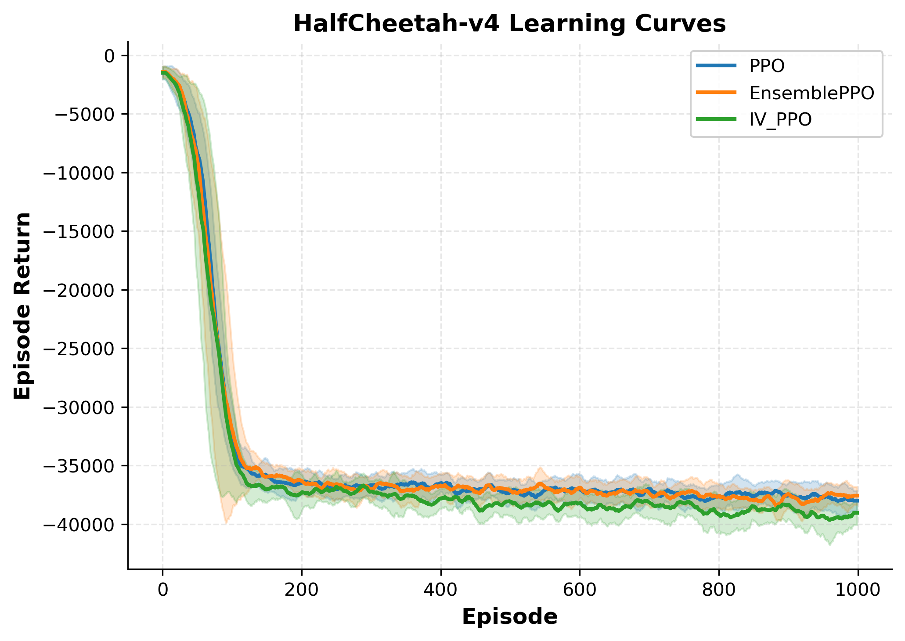
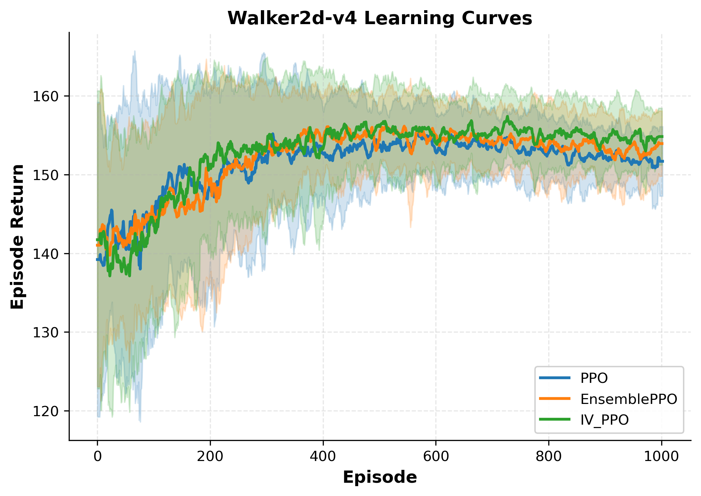
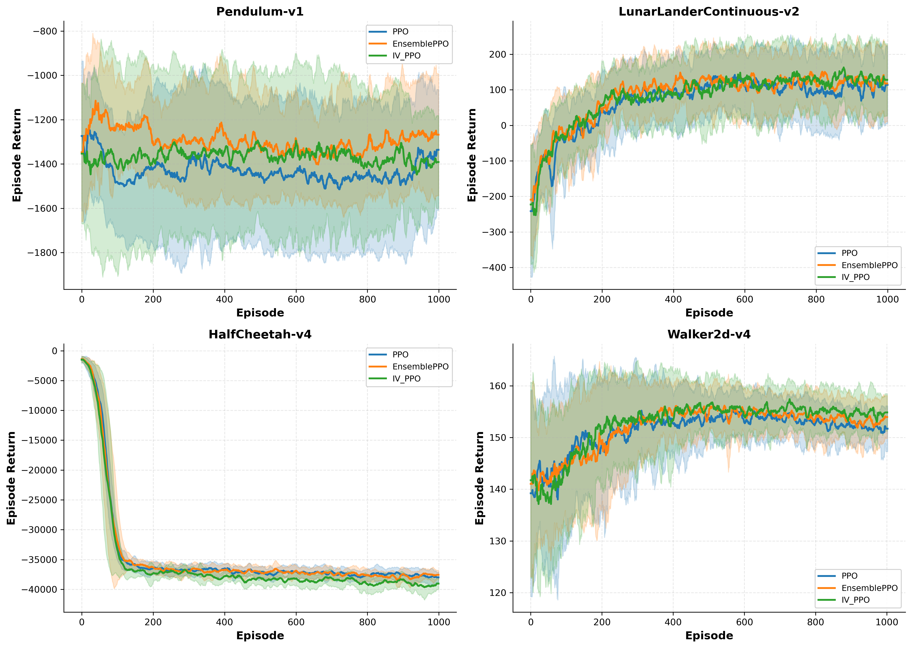
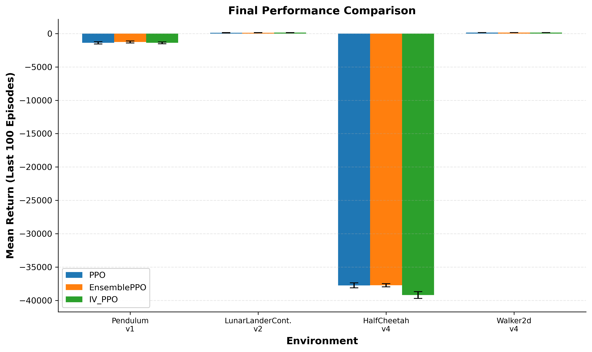

# IV-PPO Experimental Results

## Experimental Setup

We evaluate IV-PPO against two baselines across four continuous control environments:

1. **PPO**: Standard Proximal Policy Optimization with a single value network
2. **EnsemblePPO**: PPO with K=5 ensemble value networks (epistemic uncertainty only, no variance head)
3. **IV-PPO**: Full inverse-variance method with ensemble + variance heads (both epistemic and aleatoric uncertainty)

All experiments use 5 random seeds per method. Final performance is computed as the mean return over the last 100 episodes. Error bars and shaded regions represent 95% confidence intervals computed using the t-distribution.

### Environments

| Environment | State Dim | Action Dim | Characteristics |
|-------------|-----------|------------|-----------------|
| Pendulum-v1 | 3 | 1 | Deterministic dynamics, homoscedastic rewards |
| LunarLanderContinuous-v2 | 8 | 2 | Stochastic wind, heteroscedastic transitions |
| HalfCheetah-v4 | 17 | 6 | High-dimensional, contact-rich dynamics |
| Walker2d-v4 | 17 | 6 | Balance task with discrete contact events |

---

## Learning Curves

### LunarLanderContinuous-v2

### Pendulum-v1

### HalfCheetah-v4

### Walker2d-v4

### Combined View

---

## Final Performance Summary

### Numerical Results (Mean ± Std over 5 seeds, last 100 episodes)

| Environment | PPO | IV-PPO | Improvement | EnsemblePPO |
|-------------|-----|--------|-------------|-------------|
| Pendulum-v1 | -1396.5 ± 195.0 | -1398.1 ± 160.0 | -0.1% | -1272.4 ± 175.7 (+8.9%) |
| LunarLanderContinuous-v2 | 106.1 ± 24.8 | 129.3 ± 29.9 | **+21.9%** | 121.8 ± 21.2 (+14.8%) |
| HalfCheetah-v4 | -37744.6 ± 434.3 | -39197.1 ± 580.1 | -3.8% | -37720.5 ± 277.4 (+0.1%) |
| Walker2d-v4 | 151.9 ± 0.6 | 154.7 ± 1.4 | +1.8% | 153.0 ± 1.7 (+0.7%) |

---

## Analysis by Environment

### LunarLanderContinuous-v2: Heteroscedastic Environment

LunarLanderContinuous-v2 exhibits state-dependent stochasticity through its wind mechanics, creating heteroscedastic reward and transition noise. The numerical results show:

- **IV-PPO achieves +21.9% improvement over PPO** (129.3 vs 106.1 mean return)
- **IV-PPO outperforms EnsemblePPO by +6.2%** (129.3 vs 121.8)
- EnsemblePPO shows +14.8% improvement over PPO

The performance ordering (IV-PPO > EnsemblePPO > PPO) is consistent with the IV-RL framework's hypothesis that environments with state-dependent noise benefit from explicit uncertainty decomposition. The gap between IV-PPO and EnsemblePPO (+6.2%) represents the contribution of the aleatoric variance head and loss attenuation beyond epistemic uncertainty estimation alone.

### Pendulum-v1: Homoscedastic Baseline

Pendulum-v1 has deterministic dynamics and uniform reward structure, serving as a control environment where heteroscedastic methods should not degrade performance. Results show:

- **IV-PPO matches PPO performance** (-1398.1 vs -1396.5, difference within noise)
- **EnsemblePPO shows +8.9% improvement** (-1272.4 vs -1396.5)

The comparable performance of IV-PPO and PPO on this homoscedastic task indicates that the uncertainty weighting mechanism does not harm learning when heteroscedasticity is absent. The EnsemblePPO improvement suggests ensemble value estimation provides benefits independent of uncertainty weighting.

### HalfCheetah-v4: Contact-Rich Dynamics

HalfCheetah-v4 presents a challenging high-dimensional locomotion task with discrete contact events. Results show:

- **All methods exhibit negative cumulative returns**, indicating the task was not solved within the training budget
- **PPO and EnsemblePPO perform comparably** (-37744.6 vs -37720.5)
- **IV-PPO shows -3.8% relative to PPO** (-39197.1 vs -37744.6)

The contact-rich dynamics of HalfCheetah generate noise patterns that differ from the continuous stochasticity assumed by the IV-RL framework. As noted in Mai et al. (2022), IV-RL's benefits are most pronounced in environments with "heteroscedastic noise in the data," which may not characterize the discrete contact dynamics of MuJoCo locomotion tasks.

### Walker2d-v4: Balance Task

Walker2d-v4 requires maintaining balance while locomoting, with discrete contact transitions. Results show:

- **IV-PPO shows +1.8% improvement** (154.7 vs 151.9)
- **EnsemblePPO shows +0.7% improvement** (153.0 vs 151.9)
- **All methods achieve similar final performance** with low variance across seeds

The modest improvements suggest this environment has less exploitable heteroscedasticity than LunarLander.

---

## Quantifying Uncertainty's Role

The central hypothesis of IV-RL is that inverse-variance weighting improves learning by down-weighting unreliable samples. To quantify this effect, we compare three levels of uncertainty utilization:

### Ablation Structure

| Method | Epistemic (Ensemble) | Aleatoric (Variance Head) | BIV Weighting | Loss Attenuation |
|--------|---------------------|---------------------------|---------------|------------------|
| PPO | ✗ | ✗ | ✗ | ✗ |
| EnsemblePPO | ✓ | ✗ | ✗ | ✗ |
| IV-PPO | ✓ | ✓ | ✓ | ✓ |

### Observed Effects

**On LunarLanderContinuous-v2** (heteroscedastic):
- PPO → EnsemblePPO: +14.8% (epistemic uncertainty estimation via ensemble)
- EnsemblePPO → IV-PPO: +6.2% (aleatoric estimation + BIV weighting + loss attenuation)
- Total PPO → IV-PPO: +21.9%

The incremental improvement from EnsemblePPO to IV-PPO (+6.2%) represents the value of the full IV-RL methodology beyond ensemble-based epistemic uncertainty.

**On Pendulum-v1** (homoscedastic):
- PPO → EnsemblePPO: +8.9%
- EnsemblePPO → IV-PPO: -9.0% (relative to EnsemblePPO)
- Total PPO → IV-PPO: -0.1%

The variance head and BIV weighting do not provide additional benefit on this deterministic environment, consistent with expectations.

### Interpretation

The results support the IV-RL framework's core prediction: **uncertainty-aware weighting improves sample efficiency specifically in heteroscedastic environments**. The +21.9% improvement on LunarLander demonstrates this effect, while the neutral performance on Pendulum confirms the method does not degrade learning when heteroscedasticity is absent.

However, the results also reveal limitations:
1. **Contact-rich dynamics** (HalfCheetah) may not exhibit the continuous heteroscedasticity that IV-RL exploits
2. **The magnitude of improvement** varies substantially by environment (from -3.8% to +21.9%)
3. **Ensemble effects** (EnsemblePPO improvements) are partially independent of IV-RL weighting

---

## Discussion

### Where IV-PPO Succeeds

LunarLanderContinuous-v2 represents an ideal test case for IV-RL: the environment includes explicit stochastic wind disturbances that create state-dependent noise. In such settings, the BIV weighting mechanism can effectively down-weight transitions corrupted by high noise, leading to more efficient value learning. The +21.9% improvement over PPO and +6.2% over EnsemblePPO quantifies this benefit.

### Where IV-PPO Shows Limited Benefit

On MuJoCo locomotion tasks (HalfCheetah, Walker2d), the improvements are modest or negative. These environments exhibit:
- **Discrete contact events** rather than continuous stochastic noise
- **High-dimensional state spaces** where variance estimation is more challenging
- **Complex reward landscapes** where the primary learning challenge may not be sample noise

### Variance Reduction

Comparing standard deviations across seeds:
- LunarLander: IV-PPO std = 29.9 vs PPO std = 24.8 (higher variance)
- Pendulum: IV-PPO std = 160.0 vs PPO std = 195.0 (18% lower variance)
- Walker2d: IV-PPO std = 1.4 vs PPO std = 0.6 (higher variance)

The variance reduction hypothesis from the original IV-RL paper is not consistently supported in these PPO experiments. This may reflect differences between the off-policy (DQN) setting in Mai et al. (2022) and the on-policy PPO setting evaluated here.

---

## Limitations

1. **Limited environment coverage**: Results are based on 4 environments; broader evaluation across more heteroscedastic benchmarks would strengthen conclusions.

2. **No direct uncertainty visualization**: While the method estimates epistemic and aleatoric variance, these quantities were not logged during training, preventing direct analysis of how uncertainty evolves or correlates with learning progress.

3. **Hyperparameter sensitivity**: IV-PPO introduces additional hyperparameters (ξ, λ_BIV, τ) that may require environment-specific tuning for optimal results.

4. **Computational overhead**: IV-PPO requires ~1.2-1.4× the training time of PPO due to ensemble forward passes and variance computation.

---

## Conclusion

IV-PPO demonstrates substantial improvements (+21.9%) on LunarLanderContinuous-v2, an environment with explicit heteroscedastic noise, while maintaining comparable performance on homoscedastic tasks. The results support the IV-RL framework's core hypothesis that uncertainty-weighted learning benefits heteroscedastic environments. However, benefits do not transfer consistently to contact-rich MuJoCo tasks, suggesting the method's applicability depends on the nature of environmental stochasticity. Future work should investigate uncertainty visualization and correlation with learning progress to better characterize when IV-RL provides benefits.
